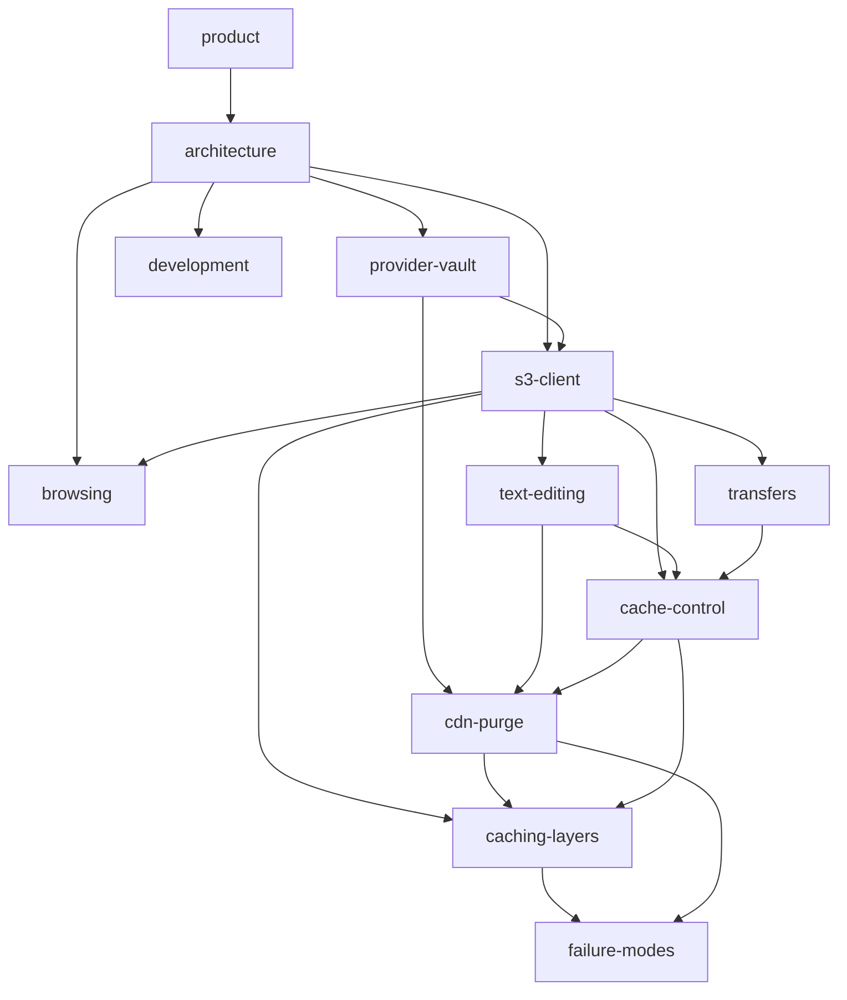

# S3 Multi — LLM Wiki

Machine-first documentation. Flat pages, dense facts, explicit relations, real
file paths. No marketing. Written to be read by an agent that needs to change
this codebase correctly on the first try.

**Format contract** (every page obeys this):

- One concept per page. Filename is the concept.
- Header block: `id`, `type`, `owns` (the files this page is authoritative for).
- `## Relations` — typed edges to other pages. Traverse these instead of guessing.
- Claims point at `path:symbol`. If a claim and the code disagree, the code wins
  and the page is stale — fix the page in the same change.
- Gotchas and failure modes are first-class content, not footnotes. They are the
  highest-value part of this wiki.

---

## Page index

| id | page | type | one-line |
|----|------|------|----------|
| `product` | [00-product.md](00-product.md) | concept | What the product is, who it is for, hard constraints |
| `architecture` | [01-architecture.md](01-architecture.md) | concept | Layers, data flow, routes, state ownership |
| `provider-vault` | [02-provider-vault.md](02-provider-vault.md) | subsystem | Credential storage, encryption, IndexedDB schema |
| `s3-client` | [03-s3-client.md](03-s3-client.md) | subsystem | SDK client construction, per-provider quirks, CORS |
| `browsing` | [04-browsing.md](04-browsing.md) | subsystem | Prefix listing, query keys, virtualization |
| `transfers` | [05-transfers.md](05-transfers.md) | subsystem | Upload/download, progress, persisted history |
| `text-editing` | [06-text-editing.md](06-text-editing.md) | subsystem | The `/edit` page: rich-text and code editors, diagnostics, save + verify pipeline |
| `cdn-purge` | [07-cdn-purge.md](07-cdn-purge.md) | subsystem | CloudFront invalidation, Cloudflare purge, the CORS wall and the two shims around it |
| `caching-layers` | [08-caching-layers.md](08-caching-layers.md) | concept | The four caches, and which one ate your edit |
| `failure-modes` | [09-failure-modes.md](09-failure-modes.md) | reference | Symptom → cause → fix catalogue |
| `development` | [10-development.md](10-development.md) | reference | Commands, checks, adding a provider field, browser-verification traps |
| `cache-control` | [11-cache-control.md](11-cache-control.md) | subsystem | Writing edge-cache headers vs always reading fresh — two opposite needs, two different params |
| `deployment` | [12-deployment.md](12-deployment.md) | operations | Shipping the static bundle: HTTPS requirement, SPA fallback, CSP and CDN headers, browser floor |

---

## Relation graph

---

## Reading paths

Pick the path, read it in order, skip the rest.

| Task | Path |
|------|------|
| "Saving a file doesn't stick" | `failure-modes` → `caching-layers` → `text-editing` |
| "Purge isn't working" | `cdn-purge` → `caching-layers` → `development` |
| "The CDN keeps hitting my bucket / the bill is too high" | `cache-control` → `caching-layers` → `cdn-purge` |
| "I'm reading stale bytes" | `cache-control` → `caching-layers` |
| "Change the editor / add a language" | `text-editing` → `architecture` |
| "Add a new S3-compatible provider" | `provider-vault` → `s3-client` → `development` |
| "Add a field to a provider" | `development` (has the exact 4-file checklist) |
| "Why is there no backend?" | `product` → `architecture` |
| "Something is CORS-blocked" | `s3-client` → `cdn-purge` → `failure-modes` |
| Orientation from zero | `product` → `architecture` → then by subsystem |

---

## Invariants

Facts that hold across the whole product. Violating one is a bug, not a design choice.

1. **No backend.** Credentials never leave the browser except to the storage
   provider itself. See [product](00-product.md).
2. **No request ever sets a fetch `cache` mode.** It appends non-CORS-safelisted
   headers and breaks every request. See [s3-client](03-s3-client.md).
3. **A write is not "saved" until it has been read back.** See
   [text-editing](06-text-editing.md).
4. **Every failure is visible to the user.** No silent `catch`, no status message
   that is set but never rendered. See [failure-modes](09-failure-modes.md).
5. **Secrets are encrypted at rest in IndexedDB.** Plaintext credentials exist
   only in memory. See [provider-vault](02-provider-vault.md).
6. **An overwrite preserves the object's metadata.** The one field a caller may
   override is `Cache-Control`, and only explicitly. See
   [text-editing](06-text-editing.md).
7. **Every read of object content or metadata sends `ResponseCacheControl: "no-cache"`.**
   The object's own stored `Cache-Control` is a different thing and is left alone.
   See [cache-control](11-cache-control.md).
8. **A spec citation is not a measurement.** Two separate bugs shipped on
   plausible-but-unverified reasoning about the HTTP cache. Measure the actual
   requests. See [caching-layers](08-caching-layers.md).
9. **The UI is stock shadcn.** Every control is a component from
   `src/components/ui/`, and every colour, radius and shadow resolves to a
   shadcn theme token. No bespoke component CSS, no second palette. See
   [architecture](01-architecture.md) § Styling.
